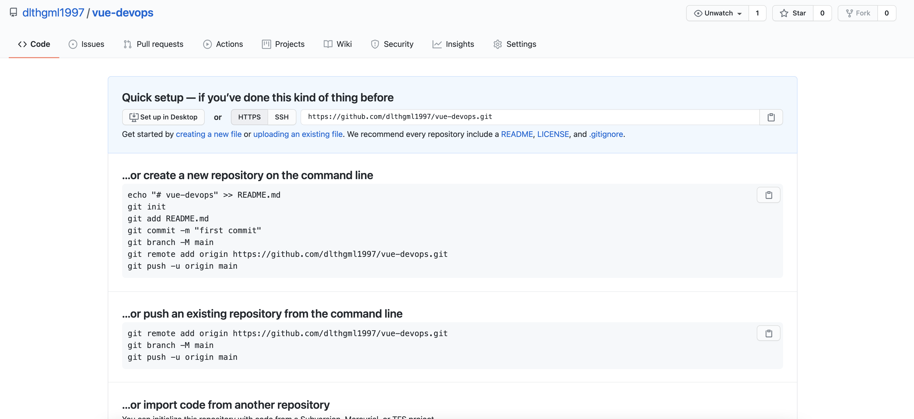
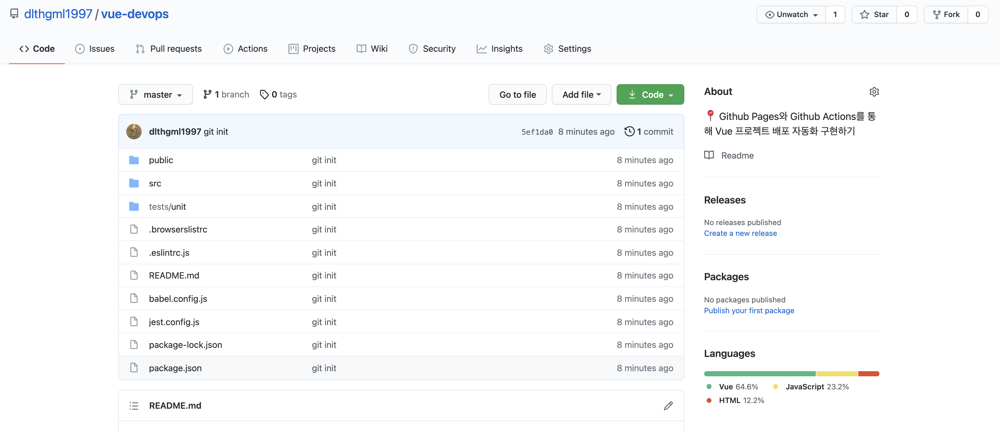
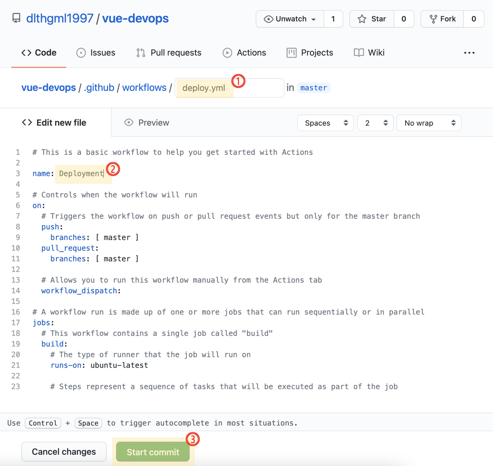
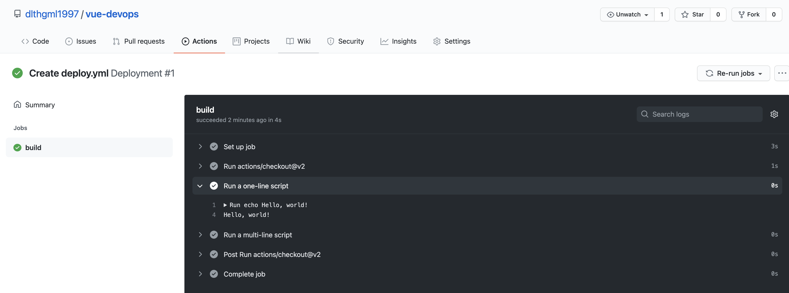
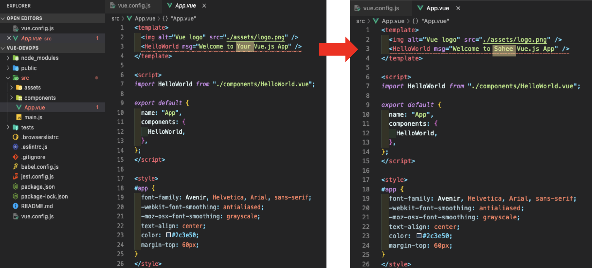
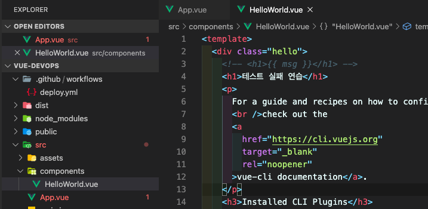
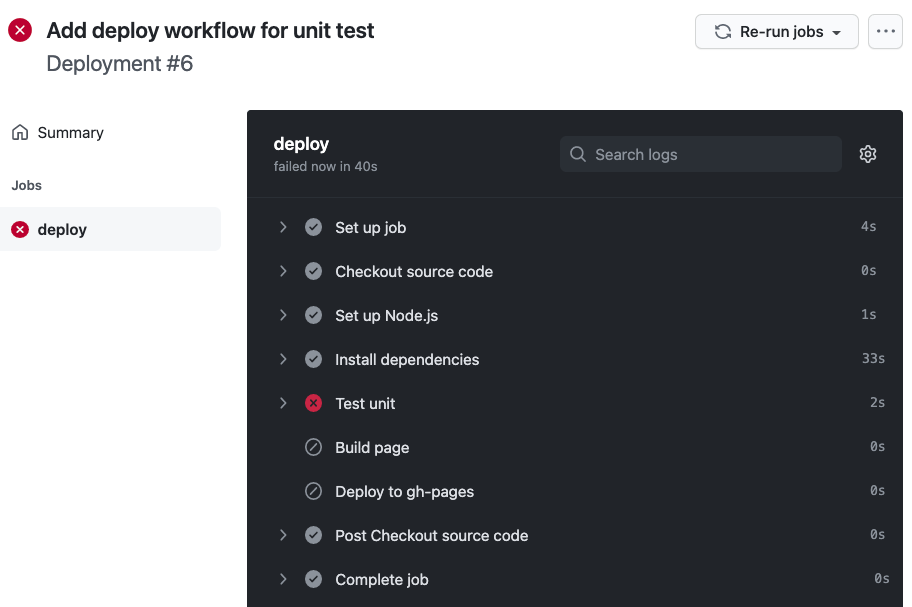

# Vue CLI 프로젝트 기반 DevOps 개발환경 실습

> :bulb: Vue CLI로 프로젝트를 생성하여 GitHub Pages에 정적 페이지 호스팅 하기 & GitHub Actions로 자동 배포 설정해서 DevOps 개발환경을 구성하는 실습하기

## 목차

1. [Vue CLI로 프로젝트 생성](#1-vue-cli로-프로젝트-생성)
2. [깃헙에 코드 Push 및 Pages에 수동 배포](#2-깃헙에-코드-push-및-pages에-수동-배포)
   1. [Git Repository 생성](#git-repository-생성)
   2. [코드 Push](#코드-push)
   3. [Github Pages에 수동 배포](#github-pages에-수동-배포)
3. [Github Actions workflow로 배포 자동화](#3-github-actions-workflow로-배포-자동화)
4. [단위 테스트 step 추가로 최소한의 안전장치 설정하기](#4-단위-테스트-step-추가로-최소한의-안전장치-설정하기)
5. [마무리](#마무리)

<br>

## 1. Vue CLI로 프로젝트 생성

> 📌 npm 모듈과 vue 설치가 선행되어야 합니다.

```
% vue create vue-devops
```


1. Manually select features 선택

2. Unit Testing 추가 선택 (Space)

3. 3.x 선택
4. Prettier 선택
5. Lint on save 선택
6. Jest 선택
7. In Dedicated config files 선택
8. N 입력

프로젝트 생성이 완료됩니다.

```
% cd vue-devops
% npm run serve
```

위 명령어를 실행 후, localhost:8080에 접속합니다.


vue 프로젝트가 정상 생성됨을 확인할 수 있습니다.

<br>

## 2. 깃헙에 코드 Push 및 Pages에 수동 배포

### Git Repository 생성




<br>

<br>

### 코드 Push

> 터미널을 이용해 vue 프로젝트 코드를 Git Repository에 Push 합니다.

1. **git init**

```
% git init
```

2. **방금 만든 repository를 해당 vue 프로젝트의 원격 origin으로 설정합니다.**

```
% git remote add origin 레포지토리 url
```

3. **모든 변경 사항(vue 프로젝트 초기 환경)을 add 합니다.**

```
% git add .
```

4. **모든 변경 사항을 commit 합니다.**

```
% git commit -m "커밋 메시지"
```

✓*현재까지의 과정은 아래의 사진처럼 진행됩니다!*


5. **모든 변경 사항을 원격에 올립(push)니다.**

```
% git push origin master
```


완료 후, 깃헙 페이지에서 정상적으로 올라갔는지 확인합니다!




<br>

<br>

### Github Pages에 수동 배포

1. 먼저, github pages로 배포하기 위한 라이브러리를 추가합니다.

```
% npm add gh-pages -D
```

2. **package.json** 파일을 열고 `homepage`, script > `predeploy`, `deploy`, `clean` 부분을 추가합니다. (하이라이트 된 부분)

   

3. 배포용 publicPath를 설정합니다.

   vue 프로젝트 최 상단에 vue.config.js 파일을 생성하여 publicPath에 생성한 repository 이름을 설정합니다.

   **vue.config.js**

   ```javascript
   module.exports = {
     publicPath: '/vue-devops/',
     outputDir: 'dist',
   };
   ```

   

   > **📌 참고**
   >
   > 만약 vue-devops 대신 <github_id>.github.io 이름으로 Github Pages 대표 repository를 만들게 되면 해당 설정을 필요하지 않습니다. 또한, 접속 주소도 sub path 없이 https://<github_id>.github.io로 가능합니다.

4. **yarn deploy 명령 실행**

   빌드 된 정적 파일을 원격 저장소의 gh-pages 브랜치를 생성해서 푸시됩니다.

   

5. 설정에서 배포된 주소를 확인한 다음 접속해 봅니다.

   > Git Repository ➡ Settings ➡ Pages !

   

   접속 시 아래 화면이 뜹니다

   

   

👏 ***이제 Vue로 개발한 프로젝트를 yarn deploy 명령어로 GitHub Pages에 수동으로 빌드된 정적 파일을 배포함으로써 서비스 운영할 수 있게 되었습니다.***


<br>

<br>

## 3. Github Actions workflow로 배포 자동화

Github Actions는 Github의 소프트웨어 개발 워크플로에서 작업을 자동화하기 위한 패키지 스크립트입니다. 개발자가 새 소스 코드를 `Push`하거나 `Pull Request` 같은 이벤트를 생성하면, 이에 반응하여 트리거하도록 구성할 수 있습니다.

> 📌 안정적인 배포 및 운영이 가능한 DevOps 환경을 구축하는 것이 목표입니다.
>
> 📌 Github Actions를 활용하여 Vue 프로젝트를 ***자동으로 테스트한 후 빌드***하여 Github Pages에 배포하는 작업을 자동화하여 목표를 달성해봅시다!

1. vue 프로젝트가 올라간 git repository의 Actions 카테고리에 들어갑니다.

   

2. Simple workflow 파일(deploy.yml)을 작성한 다음 커밋합니다.

   

   

3. 생성 후, 바로 샘플 workflow가 동작됨을 확인할 수 있습니다.

   

    

4. git pull 을 통해 deploy.yml 을 내려 받습니다.

   ```
   git pull origin master
   ```

   

5. github pages에 정상적으로 배포되는지 확인하기 위해 App.vue 파일 수정

   

6. pull 받아온 deploy.yml 파일을 아래와 같이 수정합니다.

   ```javascript
   ..생략
   # A workflow run is made up of one or more jobs that can run sequentially or in parallel
   jobs:
     # This workflow contains a single job called "build"
     deploy:
       # The type of runner that the job will run on
       runs-on: ubuntu-latest
   
       steps:
         - name: Checkout source code
           uses: actions/checkout@master
   
         - name: Set up Node.js
           uses: actions/setup-node@master
           with:
             node-version: 12.x
   
         - name: Install dependencies
           run: yarn install
   
         - name: Build page
           run: yarn build
           env:
             NODE_ENV: production
   
         - name: Deploy to gh-pages
           uses: peaceiris/actions-gh-pages@v3
           with:
             github_token: ${{ secrets.GITHUB_TOKEN }}
             publish_dir: ./dist
   ```

7. 변경된 파일들 (deploy.yml, App.vue)의 commit & push를 진행합니다.

8. Actions 목록 중 해당하는 커밋 메시지를 클릭해, 진행 중인 Workflow 동작 과정을 확인할 수 있습니다.

   > 📌 Jobs는 deploy.yml에 작성한 name과 1:1 대응하는 것을 확인할 수 있습니다.

   

9. Workflow 동작 결과와 자동 배포된 사이트 내용을 확인합니다. 성공시 사이트에 자동 배포되지만, 실패시엔 사이트에 자동 배포되지 않습니다.

   9-1. 성공

   

   **자동 배포된 사이트 이미지**

   

   9-2. 실패

   

   커밋 메시지를 클릭하면, 상세 내용을 아래 화면처럼 확인할 수 있습니다.

   

   필자의 경우엔 deploy.yml에 

   ```
         - name: Install dependencies
           run: yarn install
   ```

   코드를 생략해 yarn install 없이 yarn build 명령을 수행해 Error가 발생했고, workflow run failure가 발생했습니다.


👏 ***이제 새로운 소스 코드를 푸시하는 것만으로 신속하게 서버에 빌드 및 배포하는 기본적인 자동화 작업을 마쳤습니다!!***


<br>

<br>

## 4. 단위 테스트 step 추가로 최소한의 안전장치 설정하기

자동화가 무조건 좋은 점만 있는 것은 아닙니다. 빌드 실패시나 테스트를 통과하지 못한 코드가 운영중인 서비스에 반영되면 안되기 때문입니다. 

>  📌 최소한의 테스트 절차를 추가해 보겠습니다!

1. deploy.yml 파일의 yarn install과 yarn build 사이에 아래 단위테스트 step을 추가합니다.

   ```javascript
   - name: Test unit
     run: yarn test:unit
   ```

   

   이 코드를 작성하면 build, deploy 같은 다음 step이 더 이상 진행되지 않아 배포된 사이트에 문제가 발생하지 않습니다.

2. 실패를 유도하는 코드를 작성해보겠습니다. 

   

   3번 라인을 주석하고, 4번 라인을 추가했습니다.

   App.vue에서 전달한 props data를 사용해 랜더링하지 않아 HelloWorld.vue 컴포넌트 테스트가 실패하게 될 것입니다.

3. 변경된 파일들을 commit & push 합니다.

   

   Actions에는 정상적으로 추가되었습니다.

4. Install dependencies까지 정상 실행되었지만, Test unit에서 오류가 나면서 다음 step이 진행되지 않아 failure 되었습니다.

   

   실패 원인은 2번에 예상한 내용과 동일합니다.

   

   페이지도 "테스트 실패 연습"은 반영되지 않았습니다. (이전에 배포한 화면으로 표시됩니다.)

   

👏 ***이 과정을 컴포 넌트를 만들 때 작성자의 의도대로 동작하는지 확인하는 테스트 코드를 작성하는 것이 중요하다는 점을 알 수 있었습니다.***

<br>

## 5. 마무리

오늘 학습한 내용을 짧게 요약해보겠습니다.

1. Vue CLI로 프로젝트를 생성한 후 깃헙 레파지토리에 올리고,
2.  `gh-pages`라이브러리를 활용해 Github Pages에 수동 배포하였습니다. 
3. 그 다음, Github Actions workflow를 활용해 빌드 및 배포 자동화하는 방법을 학습한 후에
4. 마지막으로 오류가 상용 서버에 배포되는 것을 방지하기 위한 단위 테스트 step을 추가했습니다.

수고하셨습니다 ! !  🥳

